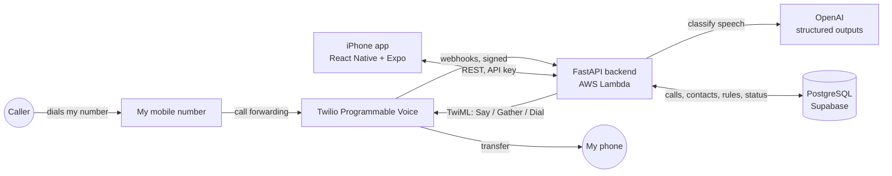

# Personal AI Phone Assistant

An AI receptionist for my own phone number. Calls to my main mobile number forward to a Twilio number, where an AI answers, asks who's calling and why, and decides what to do — put the call through to me, take a message, or hang up on spam — based on who the caller is and whether I'm free. I control it, and review every call, from an iPhone app I built.

It's live on my real number, running 24/7 on AWS Lambda.

**Try it:** call **+1 (443) 300-0069** and pretend to be a recruiter, a friend, or a telemarketer.

## What it does

- **Screens calls with AI.** The assistant asks one natural question ("Who's calling and what's it about?") plus whether it's urgent. OpenAI structured outputs extract the caller's name, company, caller type, intent and urgency while the caller is still on the line.
- **Decides what happens in real time.** A rule engine combines my current status with the caller's type and urgency to transfer the call to my phone, take a message, or reject it.
  - A recruiter calls while I'm Available → put straight through.
  - A friend calls while I'm studying → message taken.
  - A known spam number calls → hung up on immediately.
- **Knows my contacts.** Contacts are imported straight from my iPhone's address book and tagged by relationship (family, friend, recruiter, delivery…). If my rules let that group through, the assistant skips the questions, greets them by name and rings me.
- **Editable rules.** For each status (Available, Busy, Sleeping) I choose what happens to each relationship group, from the app. A few safety rules are fixed: spam is always rejected, urgent callers always get through when I'm Available, and urgent family always gets through when I'm asleep.
- **Natural-language status.** I can type (or dictate) something like *"Studying until 8, let recruiters and family through."* The app shows how it understood it before applying it, and it expires on its own.
- **Call history in the app.** Every call shows up with a summary, urgency, the AI's recommended action, the full transcript, and Call Back / Dismiss buttons.
- **Fails gracefully.** If OpenAI is down, the call still completes. If the database fails mid-call, the caller hears a normal apology, not an error tone. If the backend is unreachable entirely, a Twilio-hosted fallback rings my phone directly. If a transfer isn't answered, the caller is told their message was noted.

## Architecture



## Tech stack

| Layer | Tech |
| --- | --- |
| Phone system | Twilio Programmable Voice (speech `<Gather>`, `<Dial>` transfers, fallback TwiML Bin) |
| Backend | Python, FastAPI, psycopg |
| AI | OpenAI API (`gpt-4o-mini`, structured outputs / JSON schema) |
| Database | PostgreSQL on Supabase |
| Mobile app | React Native, Expo (SDK 57), expo-router, TypeScript |
| Security | Twilio request-signature verification, shared API-key auth |
| Deployment | Docker, AWS Lambda (container image + Lambda Web Adapter, Function URL), ECR |

## Repository layout

```text
backend/   FastAPI app (main.py), Dockerfile, docker-compose.yml
mobile/    Expo / React Native iPhone app (expo-router screens in app/)
docs/      Master build plan, per-phase write-ups, project board
```

## Running it yourself

You'll need a Twilio number, a Supabase (or any PostgreSQL) database, and an OpenAI API key.

**Backend**

```bash
cd backend
cp .env.example .env        # fill in DATABASE_URL, OPENAI_API_KEY, etc.
docker compose up           # or: pip install -r requirements.txt && uvicorn main:app
```

Point your Twilio number's Voice webhook at `<your public URL>/voice`. The full deployment to AWS Lambda is described in [docs/PHASE_17.md](docs/PHASE_17.md).

**Mobile app**

```bash
cd mobile
cp .env.example .env        # EXPO_PUBLIC_API_KEY must match backend API_SECRET
npm install
npx expo start              # run in Expo Go
```

Set `API_BASE_URL` in `mobile/lib/api.ts` to your backend URL. To install it as a standalone home-screen app instead, run `npx expo prebuild --platform ios` and build `ios/mobile.xcworkspace` with Xcode (a free Apple account works, but the build must be re-signed every 7 days).

## Lessons learned

The bugs that mattered only showed up on real phone calls, never in unit tests:

- The speech timeout cut callers off when they paused mid-sentence; it had to be tuned by ear.
- Silence was being treated as an answer, so the call moved on without one.
- Asking "who's calling?" and "what's it about?" separately made people repeat themselves, so they became one question.
- An urgent caller who didn't fit any category never got through, so urgency now overrides caller type when I'm available.
- Classification originally ran after the call ended, which made live transfers impossible; it now runs during the call.

## Known limitations

- Contact **priority** (critical / high / normal / low) is stored and shown, but routing currently uses the contact's relationship and the caller's spoken urgency, not the contact's priority.
- There's no clarifying-question loop; unclear answers fall back to safe defaults.
- The API key in the mobile app protects against casual access, not a determined attacker with the app binary — fine for a single-user personal tool (see [docs/PHASE_14.md](docs/PHASE_14.md)).

## How it was built

The project followed a phased plan, from "app runs on my phone" to "AI answers real calls on my real number." The plan is in [docs/MASTER_BUILD_PLAN.md](docs/MASTER_BUILD_PLAN.md), progress is tracked in [docs/PROJECT_BOARD.md](docs/PROJECT_BOARD.md), and each phase has its own write-up in `docs/PHASE_*.md`.
